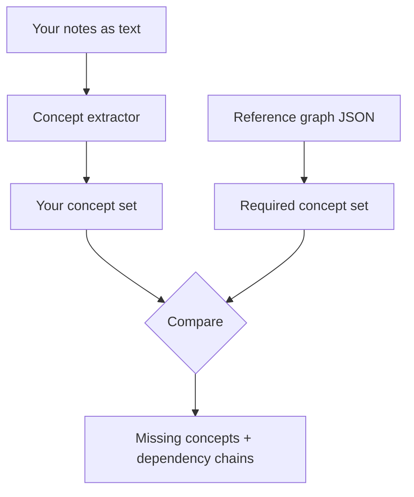

# blindspot


you know that feeling where you study for 6 hours and then the exam has an entire section on something you didn't even know was a topic? cool, this fixes that.

write what you know about a subject, blindspot compares it against a reference concept graph, and tells you exactly what you missed. turns out knowing 80% of something feels like knowing 100% of it until someone asks about the other 20%.

blindspot is the tool I wish I had back then. You write down everything you know about a topic in plain text, and it tells you what you missed. It uses spaCy to parse your writing into concepts and relationships, compares them against a reference graph, and gives you a brutally honest report of what's not there.

## How it actually works

1. You dump everything you know about a topic into a text file (or paste it in)
2. spaCy pulls out noun chunks and subject/verb/object triples to build a concept graph of your knowledge
3. That graph gets compared against a reference graph using word vector similarity (fuzzy matching, because nobody writes "cellular respiration" exactly like the textbook does)
4. You get back a coverage percentage, a list of what you missed sorted by how important it is, and a study order so you learn prerequisites first

It is not magic. It is pattern matching with extra steps. But it works better than staring at your notes and hoping you covered everything.


## example

```
$ blindspot check --topic python-basics --input my_notes.txt

scanning your notes...
found 14 concepts you covered:
  variables, functions, loops, conditionals, lists, dicts,
  strings, f-strings, imports, classes, inheritance, exceptions,
  list comprehensions, generators

missing 6 concepts from the reference graph:
  [!] decorators          (depends on: functions, closures)
  [!] context managers    (depends on: classes, exceptions)
  [!] closures            (depends on: functions, scope)
  [!] scope/LEGB          (depends on: variables, functions)
  [!] iterators           (depends on: classes, loops)
  [!] magic methods       (depends on: classes)

coverage: 70% (14/20)
biggest gap cluster: closures -> decorators -> context managers
```



## Install

```bash
pip install -e .
python -m spacy download en_core_web_md
```

You need the `en_core_web_md` model (about 43MB) because it has actual word vectors. The small model has no vectors so fuzzy matching will just return garbage.

## Usage

### Find out what you're missing

```bash
# From a file
blindspot analyze python-basics --input my_notes.txt

# From stdin
echo "Variables store data. Functions accept parameters." | blindspot analyze python-basics

# Crank up the matching strictness
blindspot analyze cell-biology --input bio_notes.txt --threshold 0.85
```

### Get JSON output

If you want to pipe results into something else:

```bash
blindspot export python-basics --input my_notes.txt --output results.json

# Or straight to stdout
echo "Vectors and matrices" | blindspot export linear-algebra | jq '.gaps[].concept'
```

### See what reference graphs exist

```bash
blindspot reference list
```

Ships with three:

| Graph | Concepts | What it covers |
|---|---|---|
| `python-basics` | 40 | Variables through generators |
| `cell-biology` | 30 | Cell structure, organelles, division |
| `linear-algebra` | 35 | Vectors through eigenvalues and SVD |

### Get info about a reference graph

```bash
blindspot reference info python-basics
```

### Check a reference graph for problems

```bash
blindspot reference validate python-basics
```

Catches orphan nodes, dangling edge references, duplicate IDs, and cycles.

### Build your own reference graph

```bash
blindspot reference create organic-chemistry
```

It walks you through adding concepts with difficulty tiers and relationships. Writes a JSON file you can edit later.

### Web UI

```bash
blindspot web --port 5000
```

Gives you a form where you paste text and pick a topic. Results include an interactive graph (via pyvis) where green nodes are things you covered, red nodes are things you missed, and yellow nodes are things you mentioned but didn't connect to anything. It is weirdly satisfying to watch the graph fill in as you study more.

## What the output looks like

```
Knowledge Gap Report: python-basics
==================================================
Coverage: 35.0% (14/40 concepts)
Your text contained 8 identifiable concepts

Concepts you covered:
  [+] data types
  [+] functions
  [+] variables

Missing concepts (sorted by importance):
  [-] loops (severity: 0.65 ######)
  [-] classes (severity: 0.50 #####)
  [-] conditionals (severity: 0.45 ####)

Missing connections:
  [~] variables -> loops: You mentioned both but did not connect them (prerequisite)

Isolated concepts (mentioned but unconnected):
  [?] scope

Suggested study order:
  1. conditionals
  2. loops
  3. classes
```

Yeah, 35% coverage. That was roughly my exam grade too.

## How severity scoring works

When you miss a concept, blindspot scores how bad that is from 0.0 to 1.0:

- **Out-degree (50% of score):** Concepts that are prerequisites for lots of other things score higher. Missing "variables" hurts more than missing "decorators" because everything depends on variables.
- **Tier bonus:** Foundational concepts (tier 1) get +0.3, intermediate (tier 2) get +0.2, advanced (tier 3) get +0.1. Missing fundamentals is worse because everything else builds on them.
- **Foundation bonus (+0.2):** Concepts with no incoming edges (true roots) get extra weight since they are entry points into the topic.

The suggested study order comes from a topological sort of your missing concepts, so you study prerequisites before things that depend on them. Because apparently "learn the basics first" needed to be computed for me.

## Reference graph format

JSON files live in `src/blindspot/references/`:

```json
{
  "nodes": [
    {"id": "variables", "tier": 1},
    {"id": "loops", "tier": 1},
    {"id": "classes", "tier": 2}
  ],
  "edges": [
    {"from": "variables", "to": "loops", "relation": "prerequisite"},
    {"from": "loops", "to": "classes", "relation": "prerequisite"}
  ]
}
```

Tiers: 1 = foundational, 2 = intermediate, 3 = advanced. Edge relations can be `prerequisite`, `includes`, or `related-to`.

Run `blindspot reference validate <name>` after creating one to catch structural issues.

## Tests

```bash
pytest -v
```

Tests cover extraction, analysis, reference loading/validation, CLI commands, report formatting, and the web interface. Some tests need the spaCy model installed to run.

## License

MIT
